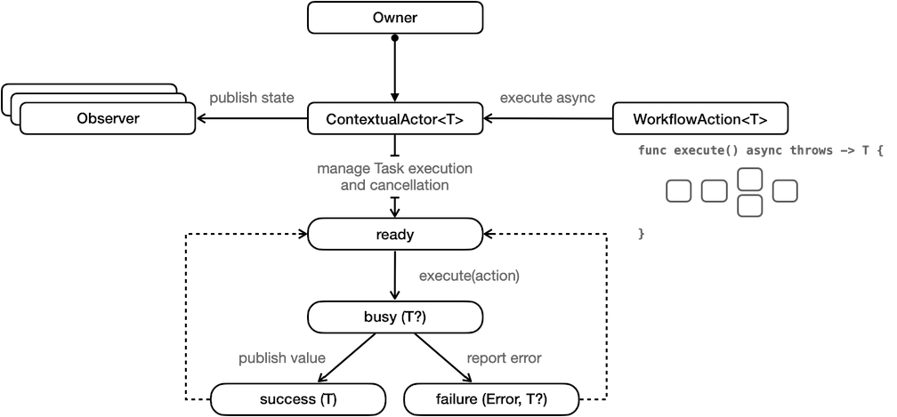

# Hollywood


The **Hollywood** library provides developers a simple API for tracking the state of an asynchronous [Swift Structured Concurrency](https://docs.swift.org/swift-book/LanguageGuide/Concurrency.html) workflow. 
There are two core APIs: `ContextualActor` and `WorkflowAction`.

A `ContextualActor` asynchronously executes and publishes the result of a `WorkflowAction` that produces type `T`.
A `ContextualActor` transitions between `ContextualActor/State`s (ready, busy, success, failure). The current
state is available by reading/ observing the published `state` property. This makes it super easy to tie in with SwiftUI.

A `WorkflowAction` is a simple command (think GoF command) implementation that asynchronously executes to produce a value `T`.
A good way to think about this protocol is that it forces you to give a discoverable name (via a concrete type) to an asynchronous
function. For a large code base, with multiple developers contributing code, this helps with discoverability,
maintenance, and just generally helps organize reusable functions.



`WorkflowAction`s are composable. This means it's super easy to stitch together `WorkflowAction`s into a complex
asynchronous execution graph. To further help with discoverability and maintenance, you can lean on the 
`CompositeWorkflowAction`. 

Example workflows that require tracking state changes:
- Fetching anything from a web service (JSON, images, etc.)
- Uploading anything to a web service.
- Performing SQLite database reads and writes.
- Long running computations. 

The **HollywoodUI** library provides a SwiftUI `View` named `ContextualActorView` that provides a consistent way to build
views that respond to `ContextualActor` state changes. 

Let's look at an example showing how to asynchronously search the [iTunes web service](https://developer.apple.com/library/archive/documentation/AudioVideo/Conceptual/iTuneSearchAPI/Searching.html#//apple_ref/doc/uid/TP40017632-CH5-SW1) 
and display the search results in a simple list view.

```swift
import Hollywood

struct SearchMusicStoreWorkflowAction: WorkflowAction {

    let searchTerm: String

    func execute() async throws -> SearchResults {
        let encoded = searchTerm.addingPercentEncoding(withAllowedCharacters: .urlPathAllowed) ?? ""
        let url = URL(string: "https://itunes.apple.com/search?term=\(encoded)")!

        let request = URLRequest(url: url)
        let (data, _) = try await URLSession.shared.data(for: request)

        // TODO: Implement proper response handling.

        let decoder = JSONDecoder()
        return try decoder.decode(SearchResults.self, from: data)
    }
}

struct SearchResults: Decodable {
    let results: [SearchResult]
}

struct SearchResult: Decodable, Hashable {

    let artistName: String
    let artworkUrl100: String
    let trackCensoredName: String
}
```

Now let's integrate the `ContextualActor<SearchResults>` with the HollywoodUI `ContextualActorView`. 

```swift
import SwiftUI

import Hollywood
import HollywoodUI

struct SearchView: View {

    @StateObject
    private var contextualActor = ContextualActor<SearchResults>()

    @StateObject
    private var debounced = Debounced<String>(input: "", delay: .milliseconds(400))
}

extension SearchView {

    var body: some View {
        ContextualActorView(contextualActor: contextualActor) { (state: ContextualActor.State) in
            SearchResultListView(results: results(for: state))
                .searchable(text: $debounced.input, placement: .automatic, prompt: "Search")
                .task(id: debounced.output, priority: .userInitiated, {
                    contextualActor.execute(SearchMusicStoreWorkflowAction(searchTerm: debounced.output))
                })
        }
        .navigationTitle("Music Search")
    }
}

extension SearchView {

    private func results(for state: ContextualActor<SearchResults>.State) -> [SearchResult] {
        switch state {
        case .ready:
            return []
        case .busy:
            return []
        case .success(let results):
            return results.results
        case .failure(_, _):
            return []
        }
    }
}

struct SearchResultListView: View {

    let results: [SearchResult]

    var body: some View {
        List {
            ForEach(results, id: \.self) { result in
                VStack(alignment: .leading) {
                    Text(result.artistName)
                        .font(.headline)

                    Text(result.trackCensoredName)
                        .font(.subheadline)
                }
            }
        }
        .listStyle(.plain)
    }
}

```

## Hollywood Demos

The [Hollywood-Demos](https://github.com/briancoyner/hollywood-demos) repo contains several working examples (including the example above). Additional examples will be added in the future. 


## Unit Tests

There are numerous unit tests showing how to use the API, as well as showing techniques for unit testing asynchronous
workflows. A **HollywoodTestKit** is in the works 

## Requirements
- iOS 16+ (yep, it's leaning on new Swift 5.7 beta features)
- macOS 12+

## Installation

The Swift Package Manager is a dependency manager integrated with the Swift build system. To learn how to use the Swift 
Package Manager for your project, please read the [docs](https://github.com/apple/swift-package-manager/blob/master/Documentation/Usage.md).  

Here's a quick example that may help:

```swift
// swift-tools-version:5.7
import PackageDescription
let package = Package(
    name: "<Your Product Name>",
    dependencies: [
        .package(url: "https://github.com/briancoyner/hollywood.git", branch: "main"),
    ],
    targets: [
        .target(
            name: "<Your Target Name>",
            dependencies: [
                "hollywood",
                "hollywoodUI"
            ]
        )
    ]
)
```

## What's Next?

- [ ] More demos are in the works, so you should watch and/ star the [Hollywood-Demos](https://github.com/briancoyner/hollywood-demos) repo.
- [ ] Introduce HollywoodTestKit to make it easier for you to write asynchronous unit tests.
- [ ] Additional SwiftUI API to help solve common problems (at least common problems I need to solve).
- [ ] Additional DocC documentation (there's a decent start, but it's far from great).


## Credits

Hollywood is written and maintained by [Brian Coyner](https://briancoyner.github.io).


## License

Hollywood and HollywoodUI is released under the MIT License.
See [LICENSE](https://github.com/briancoyner/hollywood/blob/master/LICENSE) for details.
