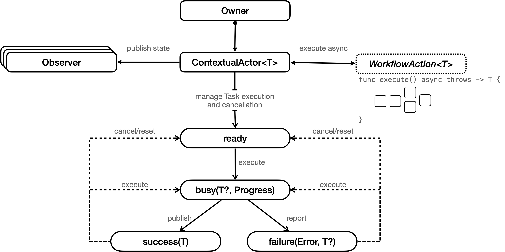

# Hollywood


<p align="leading">
    
    
    
</p>

The **Hollywood** library provides developers a simple API for tracking the state of an asynchronous [Swift Structured Concurrency](https://docs.swift.org/swift-book/LanguageGuide/Concurrency.html) workflow, with optional progress reporting.

There are two core APIs: `ContextualActor` and `WorkflowAction`.

A `ContextualActor` asynchronously executes and publishes the result of a `WorkflowAction` that produces a type `T`.
A `ContextualActor` transitions between `ContextualActor/State`s (ready, busy, success, failure). The current
state is available by reading and/or observing the `state` property. This makes it super easy to tie in with SwiftUI.

A `WorkflowAction` is a simple command (think GoF command) implementation that asynchronously executes to produce a value `T`.
A good way to think about this protocol is that it forces you to give a discoverable name (via a concrete type) to a
top-level asynchronous function. For a large code base, with multiple developers contributing code, this helps with 
discoverability, maintenance, and just generally helps organize top-level reusable functions.



`WorkflowAction`s are composable. This means it's super easy to stitch together `WorkflowAction`s into a complex
asynchronous execution graph. To further help with discoverability and maintenance, you can lean on the 
`CompositeWorkflowAction`. 

Example workflows that require tracking state changes:
- Fetching anything from a web service (JSON, images, etc.)
- Uploading anything to a web service.
- Performing SQLite database reads and writes.
- Long running computations. 

Workflows that benefit from progress reporting:
- Downloading large files over a network.
- Decompressing/ compressing large files.
- Importing a large amount of data into a local persistent store (SQLite, Core Data, etc.)
- Long running computations.

## Hollywood Demos

The [Hollywood-Demos](https://github.com/briancoyner/hollywood-demos) repo contains several working examples (including the example above). Additional examples will be added in the future. 


## Unit Tests

There are numerous unit tests showing how to use the API, as well as showing techniques for unit testing asynchronous workflows. 

## Requirements
- Swift 6+
- iOS 17+
- macOS 14+

## Adding Hollywood as a Dependency

To use the `Hollywood` library in a SwiftPM project simply add the following to your `Package.swift` file:

```
.package(url: "https://github.com/briancoyner/hollywood.git", branch: "main"),
```

```
.target(name: "<target>", dependencies: [
     .product(name: "Hollywood", package: "hollywood")
]),
```

Finally, add `import Hollywood` as needed to your source files.


## Credits

Hollywood is written and maintained by [Brian Coyner](https://briancoyner.github.io).


## License

Hollywood is released under the MIT License.
See [LICENSE](https://github.com/briancoyner/hollywood/blob/master/LICENSE) for details.
